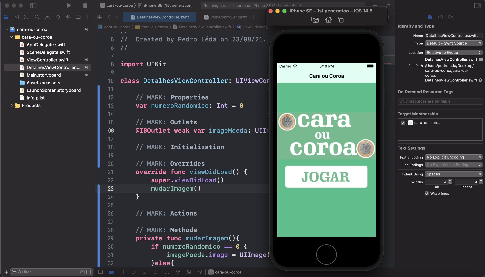
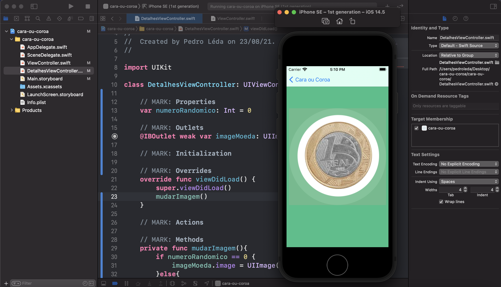

# Movie4You

## 📋 Descrição

Nesse repositório está o projeto que desenvolvi para aprender e fixar os conhecimentos em Swift. 

O app cara ou coroa como o nome já diz é um aplicatico simples onde ao precionar o botão jogar o app vai randomicamente sortear uma moeda como cara ou como coroa.

=)

## 📲 ScreenShots

### Tela inicial

### Tela com resultado

## 🖥️ Tecnologias

- Swift

## 🎨 Projeto
*✓ Finalizado (sujeito a melhorias)*
